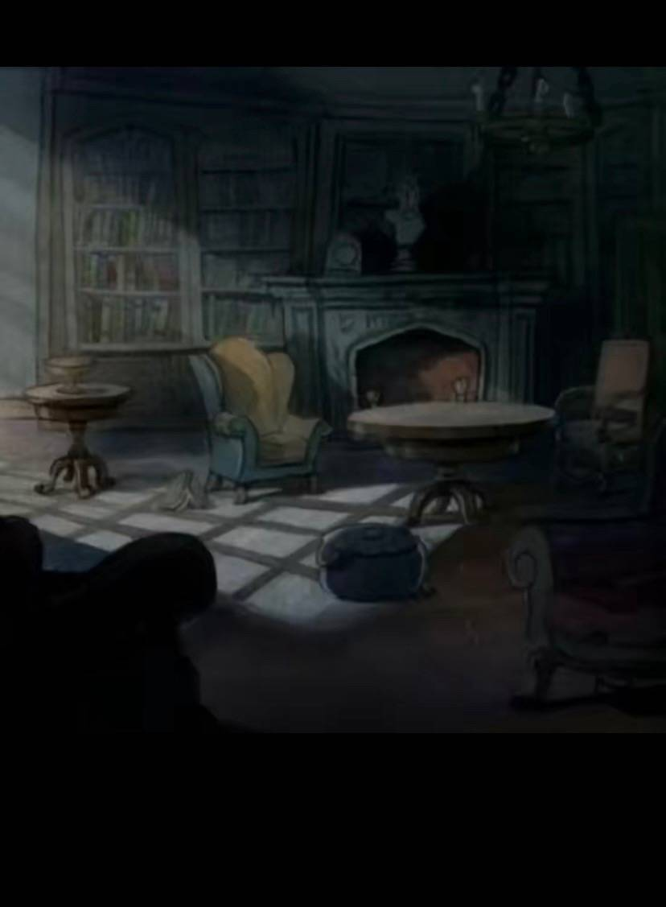
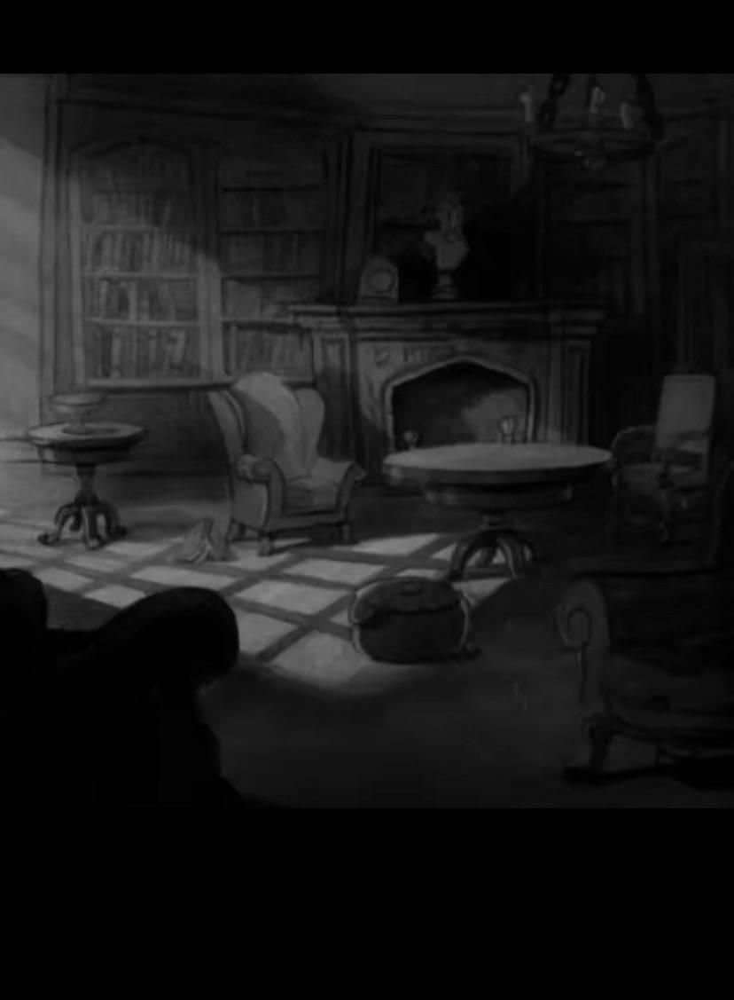

# **Image Processing Project**

## **Description**  
This project is a simple image processing script written in Python using OpenCV and Matplotlib libraries. It performs the following tasks:  
1. Converts an input image to **grayscale**.  
2. Resizes the image to **100x100 pixels**.  
3. Applies a **Gaussian blur** to the image.  
4. Displays all the processed images (grayscale, resized, and blurred) using Matplotlib.  

---

## **Features**  
- **Grayscale Conversion:** Converts the input image to grayscale and saves it as `grayscale_sample.jpg`.  
- **Image Resizing:** Resizes the input image to 100x100 pixels and saves it as `resized_sample.jpg`.  
- **Gaussian Blur:** Applies a Gaussian blur filter to the image and saves it as `blurred_sample.jpg`.  
- **Visualization:** Displays all processed images (original, grayscale, resized, and blurred) in a single window using Matplotlib.  

---

## **Requirements**  
Make sure the following dependencies are installed before running the script:  

- Python (3.x)  
- OpenCV  
- Matplotlib  

To install the required libraries, use the following command:  

```bash
pip install -r requirements.txt
```

---

## **Instructions to Run the Code**  
Follow these steps to run the project successfully:  

1. **Clone the repository**:  
   ```bash
   git clone https://github.com/YourUsername/image-processing-exam.git
   cd image-processing-exam
   ```

2. **Install dependencies**:  
   ```bash
   pip install -r requirements.txt
   ```

3. **Place an image file**:  
   Ensure an image named `sample.jpg` is placed in the project directory.  

4. **Run the script**:  
   Execute the script using the following command:  
   ```bash
   python image_processor.py
   ```

---

## **Output Files**  
The script will generate the following output images:  
- **grayscale_sample.jpg**: The grayscale version of the input image.  
- **resized_sample.jpg**: The resized version (100x100) of the input image.  
- **blurred_sample.jpg**: The blurred version of the input image.  

---

## **Sample Output Display**  
When you run the script, the following images will be displayed using Matplotlib:  
1. **Original Image**  
2. **Grayscale Image**  
3. **Resized Image**  
4. **Blurred Image**  

---

## **Example**  

Assume the input image is as follows:  

  

The following processed images will be saved and displayed:  

- **Grayscale**:  
    

- **Resized (100x100)**:  
    

- **Gaussian Blurred**:  
    

---

## **Project Structure**  

```plaintext
image-processing-exam/
│
├── image_processor.py      # Main script for image processing
├── sample.jpg              # Input image
├── grayscale_sample.jpg    # Grayscale output
├── resized_sample.jpg      # Resized output
├── blurred_sample.jpg      # Blurred output
├── requirements.txt        # List of dependencies
└── README.md               # Project documentation
```

---

## **License**  
This project is open-source and can be freely used and modified.  

---

## **Author**  
Created by **[Sana.Ghavami]**.  